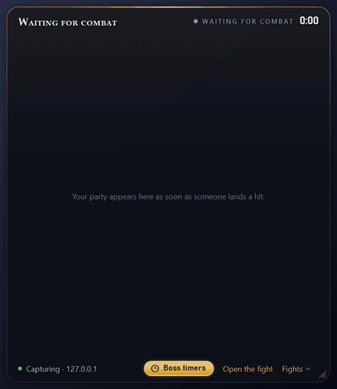
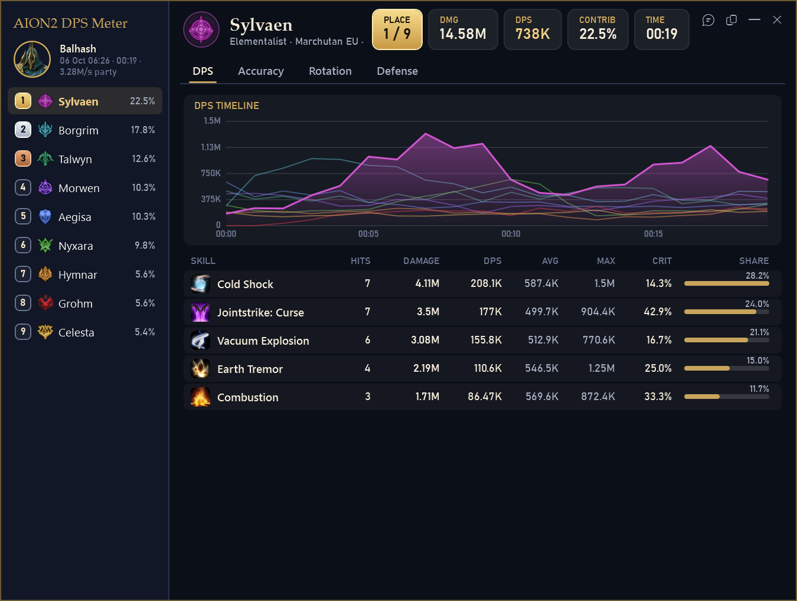
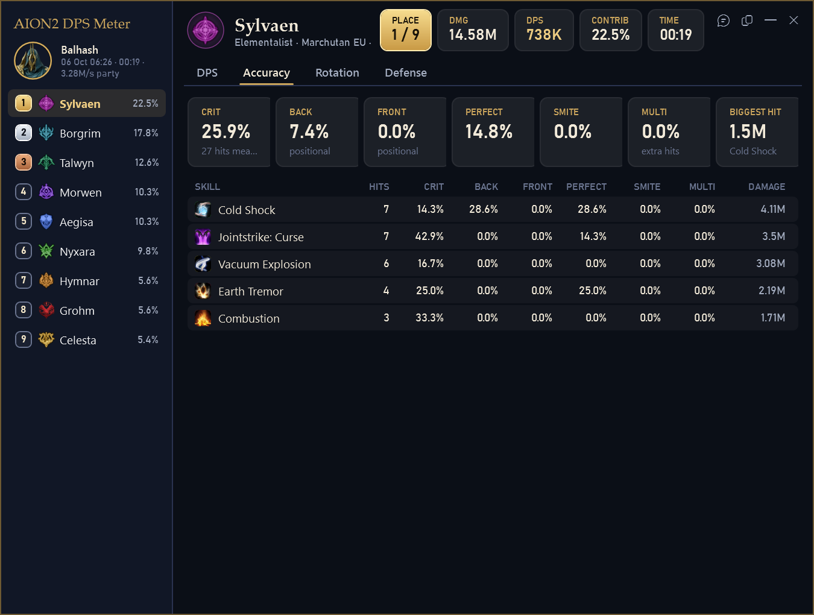
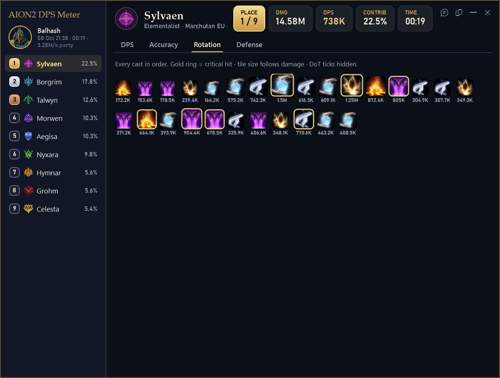
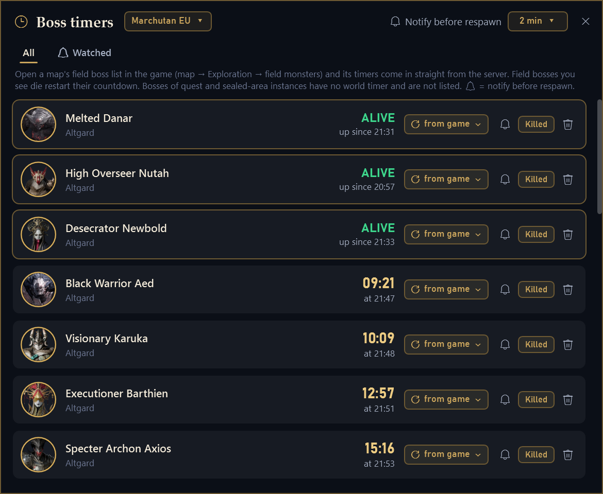
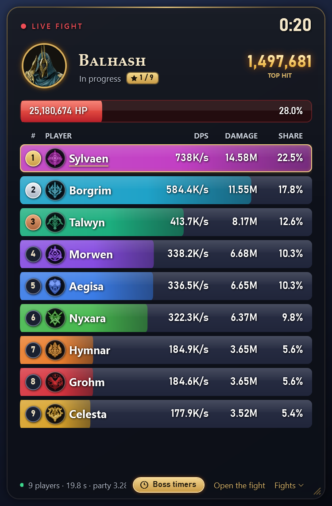
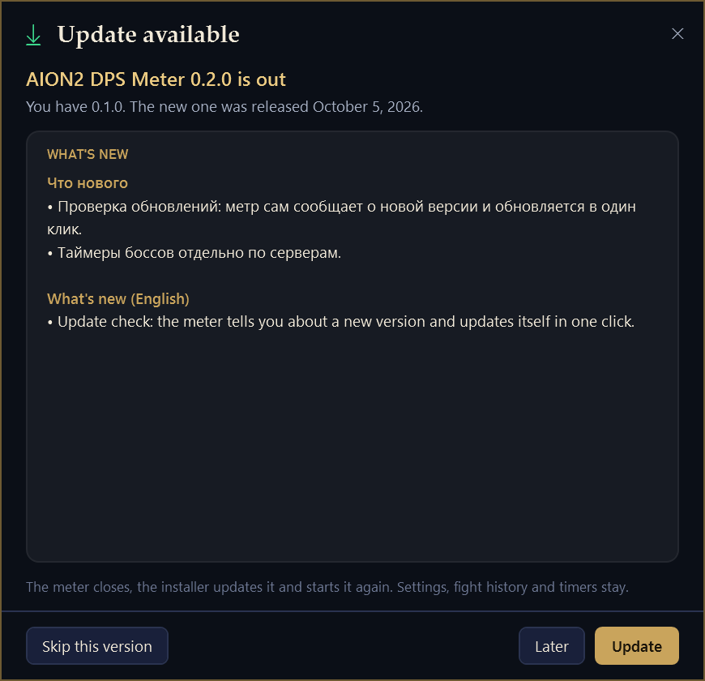
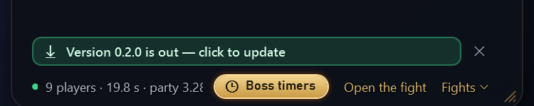

<p align="center">
  
</p>

<h1 align="center">AION2 DPS Meter</h1>

<p align="center">
  A free, open-source live DPS meter for <b>AION 2 Global (EU / NA)</b>.<br>
  Party DPS, boss HP, a full skill breakdown and field boss respawn timers — right on top of the game.
</p>

<p align="center">
  <a href="https://github.com/cyberbadger6969/aion2-dps-meter/releases/latest"></a>
  
  <a href="LICENSE"></a>
</p>

<p align="center"><b>English</b> · <a href="README.ru.md">Русский</a></p>

<p align="center">
  
</p>

> The party in the pictures is made up; the fight is scripted to show the overlay at work.

## Download

**[⬇ Download the installer](https://github.com/cyberbadger6969/aion2-dps-meter/releases/latest/download/AION2DpsMeter-Setup.exe)** · [portable zip](https://github.com/cyberbadger6969/aion2-dps-meter/releases/latest/download/AION2DpsMeter-win-x64.zip) · [all files of the latest release](https://github.com/cyberbadger6969/aion2-dps-meter/releases/latest)

These links always give the newest version:

- **`AION2DpsMeter-Setup-v<version>.exe`** — the installer (recommended). Installs for your Windows user without
  administrator rights, adds Start menu and desktop shortcuts, uninstalls from *Settings → Apps*.
- **`AION2DpsMeter-v<version>-win-x64.zip`** — the same program without installation: unzip anywhere, run
  `AION2DpsMeter.exe`.

Neither needs .NET installed: it is built in. You also need [Npcap](https://npcap.com/#download), the free capture
driver — see [Installation](#installation).

## Features

- **Live overlay** — party DPS, damage and share for every player, the boss's HP and the biggest hit, updated five
  times a second. Class colours and emblems, your own row highlighted, your place in the group (★ 2 / 9).
- **Shows up when you fight** — the overlay appears when a boss is fought nearby or you hit anything, and hides again
  60 s after the fight. Lock it in place, make it click-through, set the opacity. It never takes focus from the game.
- **Full breakdown** — click a player for their fight: DPS timeline against the party, every skill with hits, damage,
  DPS, average and biggest hit, crit rate and share.
- **Accuracy and rotation** — crit, back, front, perfect and smite rates per skill, and every cast in order with crits
  ringed in gold.
- **Fight history** — boss fights (and longer regular ones) are saved automatically; scroll through them right in the
  overlay or browse the history window.
- **Field boss timers from the game** — open the field boss list on the in-game map once and the meter keeps every
  respawn counting down, per server, with a tray alert before a boss you watch returns.
- **Share in chat** — right-click a player to copy a one-line result for the game chat.
- **English and Russian** — interface and skill / NPC names in either language, switchable at any time.
- **Updates itself** — new versions download in the background and install themselves when you are not playing.
- **Passive** — reads only your own game's network traffic; never touches game memory or sends anything to the game.

## Screenshots

<table>
  <tr>
    <td width="50%"><br><sub><b>Breakdown</b> — DPS timeline and every skill of the player</sub></td>
    <td width="50%"><br><sub><b>Accuracy</b> — crit, back, front, perfect and smite per skill</sub></td>
  </tr>
  <tr>
    <td width="50%"><br><sub><b>Rotation</b> — every cast in order, crits ringed in gold</sub></td>
    <td width="50%"><br><sub><b>Boss timers</b> — read from the in-game map, counted down to the second</sub></td>
  </tr>
  <tr>
    <td width="50%"><br><sub><b>Overlay</b> — nine players, every class</sub></td>
    <td width="50%"><br><br><sub><b>Updates</b> — the overlay announces a new version, one click installs it</sub></td>
  </tr>
</table>

## Installation

1. **Install [Npcap](https://npcap.com/#download)** — the free packet capture driver Wireshark uses. Keep its default
   options: they also capture traffic relayed by ExitLag and other ping boosters. The meter's installer checks for
   Npcap and opens the download page if it is missing. (Npcap's licence does not allow bundling it with other
   programs, so it is a separate step.)
2. **Run `AION2DpsMeter-Setup-v<version>.exe`.** If Windows says *"Windows protected your PC"*, click *More info* →
   *Run anyway*: the program is not code-signed yet. The installer speaks English and Russian, asks for a folder
   (default `%LocalAppData%\Programs\AION2 DPS Meter`) and puts shortcuts on the desktop and in the Start menu.
3. **Start the meter before entering a dungeon** — the game sends player names on loading screens, so players who were
   already around show as `#12345` until the next loading screen. Then just play: the overlay comes up when the fight
   starts.

**Portable zip:** install Npcap, unzip the archive into any folder (not inside the zip itself), run
`AION2DpsMeter.exe`. Update by unzipping a newer version over it.

**Updating:** the meter offers new versions by itself (from 0.2.0); running a newer installer by hand works too — it
closes the running meter by itself. **Uninstalling:** *Settings → Apps → AION2 DPS Meter*; it asks whether to delete your settings and history too.

Settings, fight history and timers live in `%AppData%\AionMeter` and survive updates. `INSTALL.txt` in the download has
the same instructions in English and Russian.

**Requirements:** Windows 10 or 11 (64-bit) · AION 2 on Global servers (EU or NA; Korean and Taiwanese clients are not
supported) · Npcap · about 200 MB of disk space.

## Using the meter

| | |
|---|---|
| <kbd>Ctrl</kbd>+<kbd>Shift</kbd>+<kbd>D</kbd> | show / hide the overlay |
| <kbd>Ctrl</kbd>+<kbd>Shift</kbd>+<kbd>R</kbd> or ↻ on the overlay | restart the meter when the numbers look wrong: the fight so far is saved, counting starts over, known players and bosses stay known |
| <kbd>Ctrl</kbd>+<kbd>Shift</kbd>+<kbd>L</kbd> | click-through mode: clicks go to the game |
| <kbd>Ctrl</kbd>+<kbd>Shift</kbd>+<kbd>T</kbd> | boss timers |
| left-click a player | open the breakdown |
| column header in the breakdown | sort the skills by it (skill, hits, damage, DPS, avg, max, crit, share, accuracy columns); click again to reverse |
| right-click a player | copy the result for the game chat |
| **BOSS / ALL** chip | count only the boss, or everything you hit |
| **EN / RU** chip | interface and name language (English by default; also in Settings and the tray menu) |
| fights button in the header | pick a fight: live, this session's, or saved ones by day |
| clock button / gold *Boss timers* pill | boss respawn timers |
| mouse wheel over the fight title | scroll through fights (down = older, up = newer, top = live) |
| <kbd>Ctrl</kbd> + mouse wheel over the rows | row size, 50–100 % (also *Settings → Overlay → Row size*) |
| gold **A** in the notification area | history, timers, settings, language, updates, exit |

Hotkeys can be changed in Settings. The toolbar appears when the mouse is over the overlay.

The overlay **shows up by itself** when a boss is fought nearby or you hit anything, and hides 60 s after the fight if
it came up by itself (*Settings → Overlay*). Hide it by hand during a fight and it stays hidden until the next one.
It also comes up when the meter starts and when the game starts (once per launch of the game), and starting the meter
again — say, from the desktop shortcut — simply brings the overlay up.

### Fight history

Fights are saved to `%AppData%\AionMeter\fights` (one file per fight plus `index.jsonl`). By default: every boss fight
and regular fights longer than 20 s — change it in *Settings → Fight history*. Open a saved fight in the overlay (fights
button or mouse wheel over the title) or in the *Fight history* window (filters All / Bosses / Kills, *Show in
overlay*). When a new fight starts, the overlay returns to live by itself.

### Field boss respawn timers

The timers come **from the game**. While the field boss list is open on the in-game map (*Map → Exploration → Field
monsters*), the server sends packet `01 91`: the map number and, for each boss, "alive since …" or "back at …". The meter
shows the same timers in its window, counted down to the second. They refresh whenever the list is open; in between,
the meter notices boss kills nearby and starts the countdown from a learned interval (marked "≈"; it can also be set by
hand).

The packet has no NPC codes — only a slot (map number × 100 + place in the list), and the list holds the map's bosses
sorted by code, all from one block of a thousand codes (Altgard, map 1110 → 2400xxx). Known maps are in
`data/field_boss_maps.json`; for a new map the block is learned from the first boss the meter sees there, and only
accepted when the block's boss count matches the list. Until then bosses show as "Field boss #N".

The 🔔 on a boss gives a tray alert 2 minutes before it respawns (adjustable in the timers window); the bell turns on by
itself when you are near a boss kill. Every server has its own bosses and times, so timers are kept **per server** —
the server of the character you play (known from the login packet and the name cache). The window header shows it
("Marchutan EU ▾") and can switch to another server you played on; alerts and the overlay pill follow the current one.

### Updates

The meter checks GitHub for a new version shortly after start and every 2 hours (*Settings → Updates*, or *Check for
updates* in the tray menu).

An installed copy **updates itself**: it downloads the new installer in the background, checks its size and SHA-256
against what GitHub reports, and installs it at a quiet moment — right away when the game is not running, or after 10
minutes without a fight while it runs. The installer runs with no window at all (`/VERYSILENT /RELAUNCH=1`), the meter
restarts by itself and says "Updated to …". Until then the overlay banner and a tray notification say the update is
ready; click either to install it at once. If the installer fails, the old version starts again. Turn this off in
*Settings → Updates* ("Install updates by itself") to be asked instead: then a new version brings the banner, a tray
notification and an *Update to …* tray item, and the update window offers *Update*, *Later* and *Skip this version*
(the update window shows what's new in the interface language).

A portable copy (zip) cannot replace itself: it announces new versions and opens the download page. The only thing sent is the request to `api.github.com` itself (user agent `AION2DpsMeter/<version>`).

### Who counts as a player

Elementalist spirits, pets and "living" skill effects (Bittercold Wind, Wall of Fire …) appear in the game as separate
objects with their own ids. Their damage goes to the owner — through the spawn packet's owner link, the summoner's name,
the cast (an effect ticks with the same skill variant that created it) or the power scalar. When no owner can be found,
the damage goes to a "Summons (owner unknown)" row, listed last and left out of the player count and places. Players
with less than 0.1 % of the damage show "<0.1%".

### Skill icons and boss portraits

Skill icons are downloaded from the official AION 2 CDN (`assets.playnccdn.com`), boss portraits from
[MetaBot.GG](https://metabot.gg/en/aion-2/bosses). Every picture is requested once and cached in
`%AppData%\AionMeter\icons` and `…\portraits`; portraits the site does not have are not asked for again for a week.
Turn it off in *Settings* ("Download skill icons and boss portraits") and a skull stands in for the portrait.

## FAQ

**Can I get banned for this?**
The meter does not touch the game: no memory reading, no injection, nothing is sent to the game. Still, any
third-party tool may be against the game's terms of service — use it at your own risk.

**Some players show as "#12345" instead of a name.**
The game sends names on loading screens. Start the meter before entering a dungeon; players who were already around get
their names after the next loading screen.

**Does it work with ExitLag or a VPN?**
Yes with ExitLag and other ping boosters. If a VPN hides the game connection, choose the network adapter in
*Settings → Capture*.

**The boss timers are empty.**
Open the field boss list on the in-game map (*Map → Exploration → Field monsters*) once: the meter reads the timers from
it and keeps counting.

**My antivirus or SmartScreen complains.**
The program is new, not code-signed, and it captures network traffic, which some antiviruses dislike. The source is
here: read it or build it yourself.

**My crit rate on a crowded field boss is almost zero.**
On busy field bosses the game reports very few critical hits for some classes; the meter shows exactly what the server
sends. On other targets the numbers look as usual.

**Where are my settings and fights? How do I uninstall?**
In `%AppData%\AionMeter`. Uninstall from *Settings → Apps*; it asks whether to delete settings and history as well.

## Privacy

The meter reads the game's traffic on your PC and keeps everything there. Its own network requests are: skill icons
from the official AION 2 CDN and boss portraits from MetaBot.GG (both can be turned off) and the update
check to `api.github.com` (*Settings → Updates*). No telemetry, no accounts. Packet recordings (*Settings → Capture → Record packets*, off by
default) contain your game traffic including character names — do not publish them.

## Building from source

Requirements: Windows 10/11 x64, [.NET 10 SDK](https://dotnet.microsoft.com/download), [Npcap](https://npcap.com)
(default options).

```bash
dotnet build AionMeter.sln -c Release
dotnet test tests/AionMeter.Tests
```

```bash
src/AionMeter.App/bin/Release/net10.0-windows/AION2DpsMeter.exe
```

**Releases:** bump `<Version>` in `src/AionMeter.App/AionMeter.App.csproj`, then run `.\build-release.ps1`. It writes to
`dist\` the installer (needs [Inno Setup 7](https://jrsoftware.org/isdl.php); script `installer/AION2DpsMeter.iss`),
the portable zip, the source zip, and copies of the installer and zip under fixed names (`AION2DpsMeter-Setup.exe`,
`AION2DpsMeter-win-x64.zip`) so that `releases/latest/download/<name>` always gives the newest version. Publish them
together as a GitHub release tagged `v<version>` (not a pre-release: the update check reads `/releases/latest` and needs
the `*Setup*.exe` asset).

```powershell
gh release create v<version> dist\AION2DpsMeter-Setup-v<version>.exe dist\AION2DpsMeter-Setup.exe dist\AION2DpsMeter-v<version>-win-x64.zip dist\AION2DpsMeter-win-x64.zip dist\AION2DpsMeter-v<version>-source.zip --title "AION2 DPS Meter <version>" --notes-file notes.md
```

**Screenshots and video:** `tools/make-site-kit.ps1` renders the pictures in this README, English and Russian
screenshots, a social preview and the fight animation (MP4 / GIF, needs ffmpeg) into `site-kit\` and
`dist\AION2DpsMeter-site-kit.zip`, together with the download page brief from `docs/site`.

## How it works

```
Npcap (loopback / NIC) ─► PacketPipeline ─► TcpReassembler ─► FrameDecoder ─► PacketParser ─► CombatTracker ─► UI
   finds AION2.exe's        locks onto the     order, gaps        varint frames,    opcodes →        fight segments,
   TCP connections in       stream by its                         LZ4 bundles       events           boss, wipe, DPS
   the Windows TCP table    heartbeat 0E 00 36
```

- `src/AionMeter.Core` — capture, protocol, combat engine, history, update feed (no UI)
- `src/AionMeter.App` — the WPF overlay, breakdown, history, timers, settings, updates, tray
- `src/AionMeter.Cli` — developer tool `aionmeter-cli`
- `tests/AionMeter.Tests` — tests on bytes from real EU captures
- `data/` — skill / NPC / boss name tables in 10 languages (see `data/NOTICE.md`)
- `installer/` — Inno Setup script and wizard art

### aionmeter-cli

```bash
aionmeter-cli conns                          # the game process and its connections
aionmeter-cli live 60 --record               # live capture + recording to captures/*.pcap
aionmeter-cli replay captures/x.pcap --boss --lang ru
aionmeter-cli dump captures/x.pcap 0438      # raw damage packets
aionmeter-cli update-check --pretend 0.0.1   # what the update check sees on GitHub
```

### Development switches of AION2DpsMeter.exe

| | |
|---|---|
| `--render-sample out.png` | draw the overlay with a scripted fight of every class into a PNG and exit — no window, no capture, no settings or history touched, safe while the game runs. Also `--window breakdown\|timers\|update\|overlay-update`, `--tab accuracy\|rotation`, `--lang ru`, `--backdrop game\|dark\|none`, `--width`, `--height`, `--scale` |
| `--render-sample <folder> --animate 12 --fps 10` | the overlay frame by frame through the scripted fight, for videos |
| `--demo` | a synthetic fight (mixes with live data — not while playing) |
| `--replay file.pcap --open-last [--tab rotation]` | run a recording through the meter and open the breakdown |
| `--show` | show the overlay this run even if it is hidden in settings |

## License and credits

GPL-3.0 — see [LICENSE](LICENSE). Game data tables come from the GPL-3.0 projects
[A2Tools-DPS-Meter](https://github.com/taengu/A2Tools-DPS-Meter) (taengu) and
[AIon2-Dps-Meter](https://github.com/Kuroukihime/AIon2-Dps-Meter) (Kuroukihime), see [data/NOTICE.md](data/NOTICE.md).
Skill icons come from the official AION 2 CDN, boss portraits from [MetaBot.GG](https://metabot.gg). AION 2 and its game
data and art are © NCSOFT; this project is not affiliated with NCSOFT.
